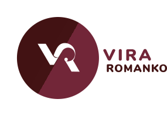

# Portfolio Website

Hi! This is my portfolio site build.

## Deployment

You can visit my site at https://viraromanko.herokuapp.com/

## Heroku Breakpoint
For some reason Heroku crashes on my lightbox functionality. So I just commented out the code that is responsible for it (main.js). It was not working perfectyly in my localhost - but it was working.... I still left the code so you can see that it is there.

## PHP Contact Form
For testing PHP contact form just use php folder.
In terminal go ``docker-compose up``

## Build with/ Tools
* **HTML5**
* **SASS/CSS3**
* **JavaScript**
* **Node.js**
* **Express**
* **Gulp**
* **SQL/mysql**

## Workspace (development)
* Visual Studio Code
* Terminal
* GitHub

## Workspace (design)
* Adobe Photoshop/Illustrator/XD/C4d

## Authors
* **Vira Romanko** -*Developer/Designer*

## Acknowledgment/References

* **Pinterest/Dribbble/Google** - *Design inspiration/images* 

## Future Plans
* add category filter in portfolio section
* finish up backend part for contact section
* figure out hosting issues
* add morph svg with GreenSock 
* make page for each portfolio project, add more text
* change hero air balloon to something different
* fix brocken gifs and use ScrollMagic/AOS

